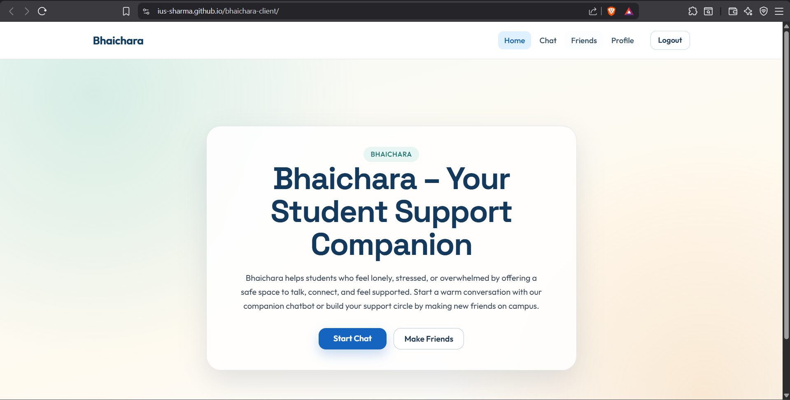
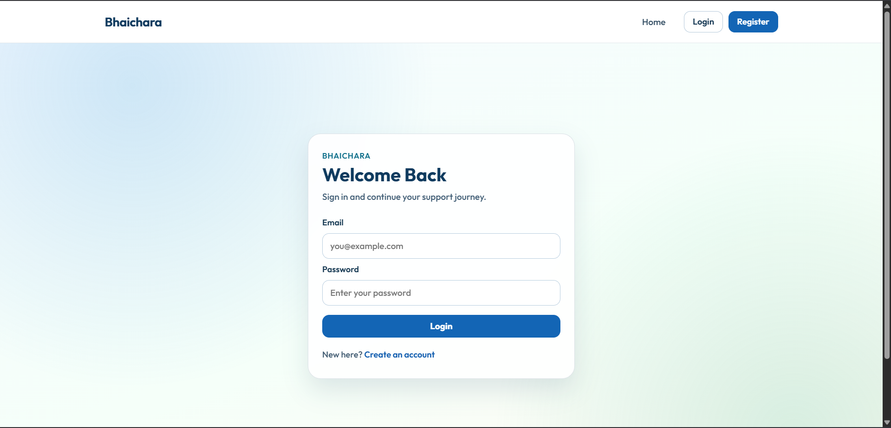
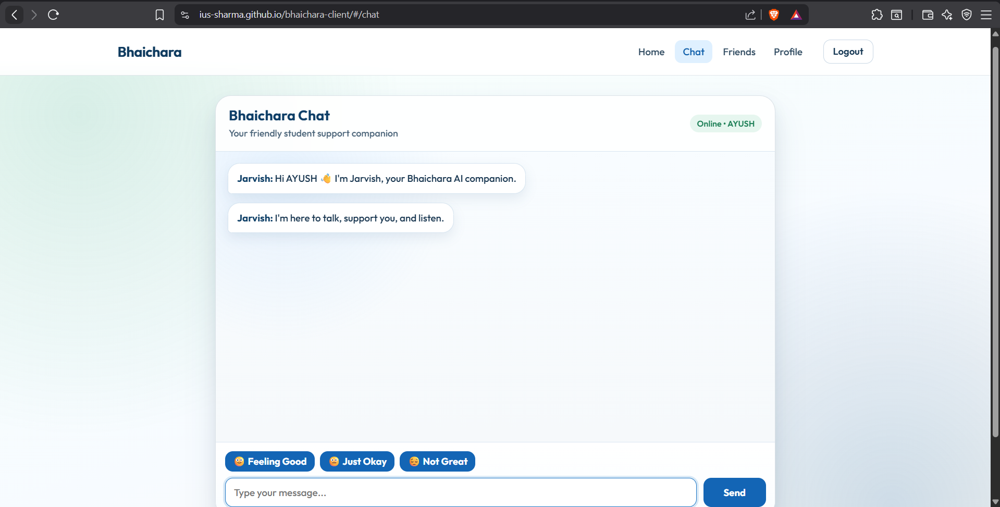
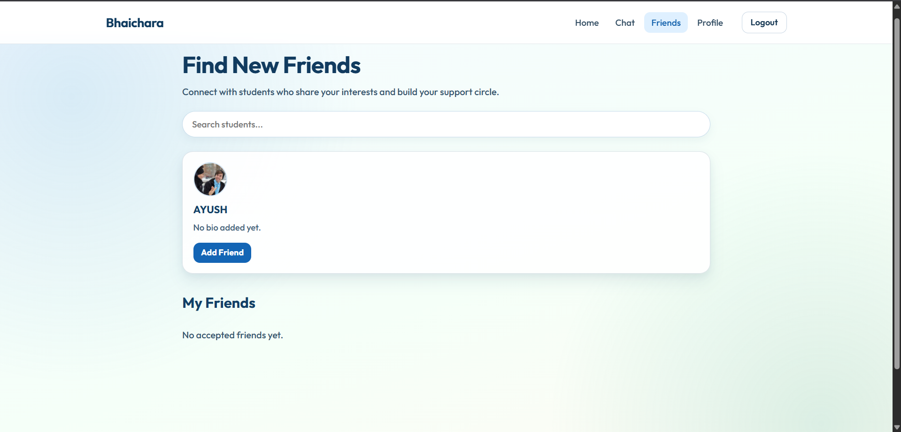
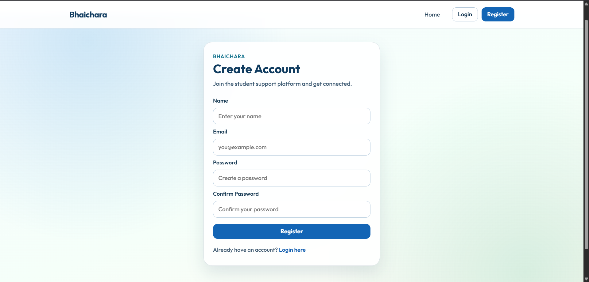

# 🤝 Bhaichara – AI Student Support Platform


Bhaichara is an **AI-powered student support platform** designed to help students talk about stress, studies, and campus life.

It combines **AI conversation**, **student networking**, and **emotional support tools** into one modern platform.

The goal of Bhaichara is simple:

> No student should feel alone during their academic journey.

---

# 🌐 Live Demo

Frontend
https://ius-sharma.github.io/bhaichara-client/

Backend API
https://bhaichara-api.onrender.com

---

# 🧠 Key Features

### 🤖 AI Companion

Students can chat with an AI companion that behaves like a supportive friend.

### 🎭 Mood Detection

The AI analyzes the user's emotional tone and responds accordingly.

### 🧠 AI Personality Customization

Users can customize the name of their AI companion. [ pending ]

### 👥 Friend System

Students can find and connect with other students on the platform.

### 💬 Chat Interface

A clean, modern chat interface designed for smooth conversations.

### 🧾 Conversation History

AI conversations are stored and can be revisited later. [ pending ]

### 🖼 Avatar Upload

Users can upload profile pictures with a hover-to-change option.

### ⚡ Fast & Responsive UI

Minimal and student-friendly design for easy interaction. [ Gonna Upgrade Day By Day ]

---

# 🏗 System Architecture

```
Frontend (React + Vite)
        ↓
   GitHub Pages
        ↓
Backend (Node.js + Express)
        ↓
      Render
        ↓
   MongoDB Atlas
        ↓
      AI (Groq API - open source AI LLM)
```

---

# 🛠 Tech Stack

### Frontend

* React
* Vite
* React Router
* CSS

### Backend

* Node.js
* Express.js

### Database

* MongoDB Atlas
* Mongoose

### AI

* Groq API open source LLM model

### Deployment

* GitHub Pages
* Render

---

# 📂 Project Structure

```
bhaichara
│
├── client
│   ├── src
│   │   ├── components
│   │   ├── pages
│   │   ├── styles
│   │   └── App.jsx
│   │
│   └── vite.config.js
│
├── bhaichara-backend
│   ├── routes
│   ├── models
│   ├── controllers
│   ├── config
│   └── server.js
```

---

# 📸 Screenshots

Example:

Home


Login Page


Chat Interface


Friends Page


Register Page


---

# ⚙️ Installation Guide

### 1️⃣ Clone Repository

```
git clone https://github.com/ius-sharma/bhaichara-client.git
```

---

### 2️⃣ Install Frontend Dependencies

```
cd client
npm install
```

---

### 3️⃣ Run Frontend

```
npm run dev
```

---

### 4️⃣ Run Backend

```
cd bhaichara-backend
npm install
npm start
```

---

# 🔮 Future Improvements [Soon]

* Real-time chat with Socket.io
* AI emotional memory system
* Student support communities
* AI mood analytics dashboard
* Mobile app version
* Voice interaction with AI

---

# 👨‍💻 Author

Ayush Sharma

Computer Science Student passionate about:

* AI Development
* Web Development
* Building impactful products

GitHub:

https://github.com/ius-sharma

LinkedIn: 

https://www.linkedin.com/in/ayush-sharma-833163320/

Instagram:

www.instagram.com/ius.sharma

Leetcode:

https://leetcode.com/u/iussharma/

HackerRank

Soon...

---

# ⭐ Support

If you like this project, consider giving it a **star ⭐ on GitHub**.

Your support helps improve the project and motivates future development.
